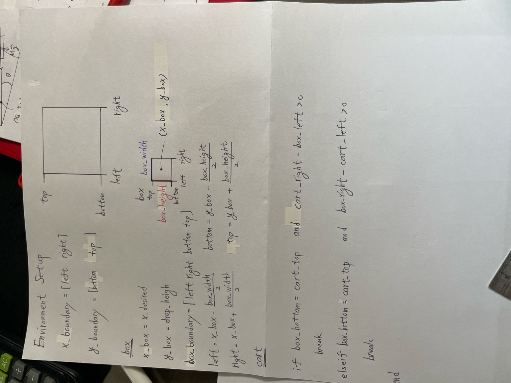

# PID Control Project

This repository contains two MATLAB scripts that explore the application of PID controllers in controlling two different dynamic systems: a magnetic train and a water tank. While both systems demonstrate the principles of PID control, they also highlight certain challenges that remain unresolved.

## Table of Contents
- [Introduction](#introduction)
- [Magnetic Train](#magnetic-train)
- [Water Tank](#water-tank)
- [Requirements](#requirements)
- [Usage](#usage)
- [License](#license)

## Introduction

The objective of this project is to demonstrate the use of PID (Proportional-Integral-Derivative) controllers in stabilizing two dynamic systems:
1. **Magnetic Train**: A system where the goal is to maintain the levitation of a train.
2. **Water Tank**: A system where the water level is controlled to remain within desired bounds.

Each section outlines the current state of the simulations and the issues that still need to be addressed.

## Magnetic Train

### Description
- **Script**: `magnetic_train.m`
- **Objective**: To maintain the stable levitation of a magnetic train using a PID controller.

### Unresolved Issues
- **Nonlinearities in Magnetic Force**: The simulation currently does not fully account for the nonlinear relationship between the magnetic force and the distance from the magnets. This leads to instability at certain positions.
- **Tuning PID Parameters**: The PID parameters require further tuning to achieve smoother control without oscillations.
- **Sensor Noise**: The impact of sensor noise on the stability of the system has not yet been fully analyzed.

## Water Tank

### Description
- **Script**: `water_tank.m`
- **Objective**: To maintain a desired water level in the tank by controlling the inflow using a PID controller.

### Unresolved Issues
- **Delay in Water Flow Response**: The model currently does not accurately simulate the delay in water flow response, which affects the controller's performance.
- **Over-Compensation**: The PID controller tends to over-compensate for changes in the water level, leading to oscillations around the setpoint.
- **System Linearization**: The water tank system assumes linear behavior, which may not hold true for larger disturbances or changes in the inflow rate.

## Requirements

- MATLAB R2020b or later
- Control System Toolbox (optional but recommended for more advanced simulations)
- 

## Usage

1. Clone this repository to your local machine:
   ```bash
   git clone https://github.com/20030726/PID.git
